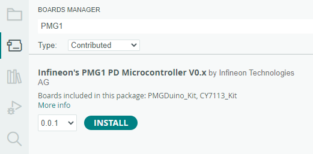
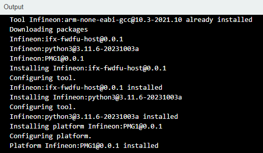
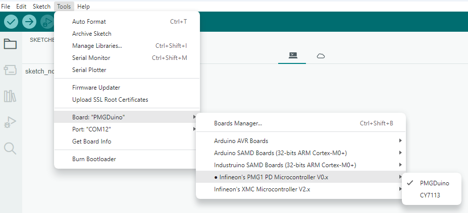

# Infineon's PMG1 Microcontroller Boards for Arduino

This repository integrates [Infineon's](https://www.infineon.com/) PMG1 microcontrollers into the [Arduino IDE](https://www.arduino.cc/en/main/software).

## Contents

- [Infineon's PMG1 Microcontroller Boards for Arduino](#infineons-pmg1-microcontroller-boards-for-arduino)
  
  [Contents](#contents)
  
  [Supported Microcontroller Boards](#supported-microcontroller-boards)
  
  [Additional Information](#additional-information)
  
  [Installation Instructions](#installation-instructions)
  
  - [Using Arduino IDE](#using-arduino-ide)
  
  [Contributing and Third Party Libraries](#contributing-and-third-party-libraries)
  
  [Additional Contributors](#additional-contributors)

## Supported Microcontroller Boards

* PMGDuino board

## Additional Information

Please visit also the Wiki for additional information, e.g. datasheets, pin out diagrams, etc.:

## Installation Instructions

### Using Arduino IDE


Paste the following URL into the 'Additional Boards Manager URLs' input field under **File** > **Preferences** to add Infineon's microcontroller boards to the Arduino IDE.

https://github.com/williamc1014/PMG1_Duino/releases/download/V0.1.2/package_PMG1_index.json

Easier to copy (no clickable link):

```
https://github.com/williamc1014/PMG1_Duino/releases/download/V0.1.2/package_PMG1_index.json
```


To install the boards, please navigate to **Tools** > **Board** > **Boards Manager...** and search for PMG1. You will find options to install the board files for the microcontrollers. Click "Install" to add the boards to your Arduino IDE.



Once you can see the message output in Arduino IDE Output console as an example shown below, it means all the necessary components including Arm compilers, Python 3.x distribution package and PMGDuino firmware package are well installed in your PC.



In the boards list **Tools** > **Board**, the PMG1 microcontroller boards are added and can be used from now on.



**Important Notes**

* This integration will only work for Arduino IDE >=1.5.

#### 

### Contributing and Third Party Libraries

To contribute enhancements, fixes and the like see *Contributors.md*. in root folder

Third Party or external library maintainers see *Libraries.md*. in root folder

Also see [Wiki](https://github.com/williamc1014/PMGDuino/wiki) for any additional information

## Additional Contributors

* 
